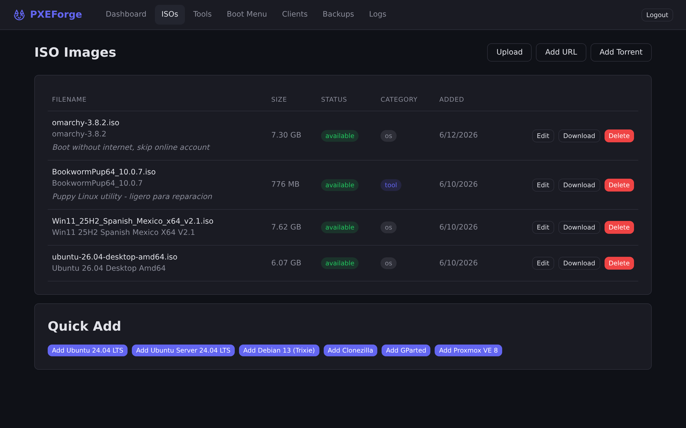
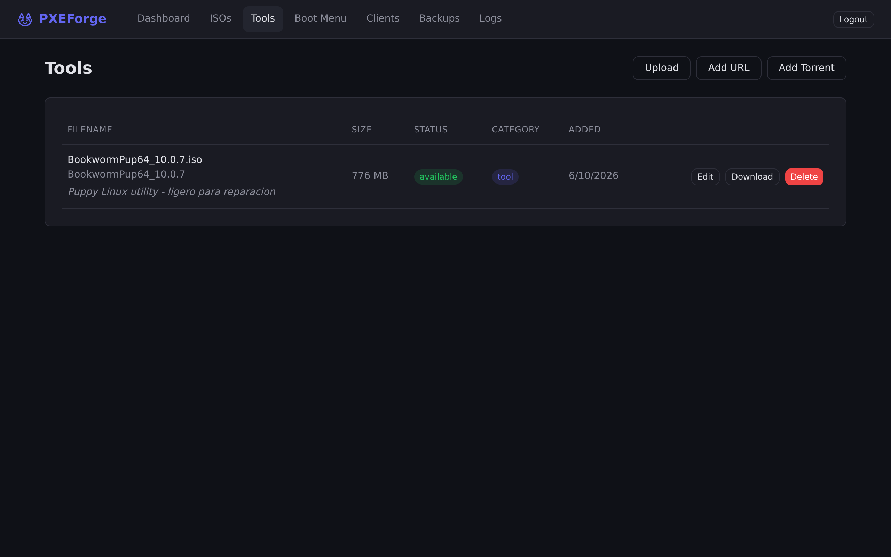
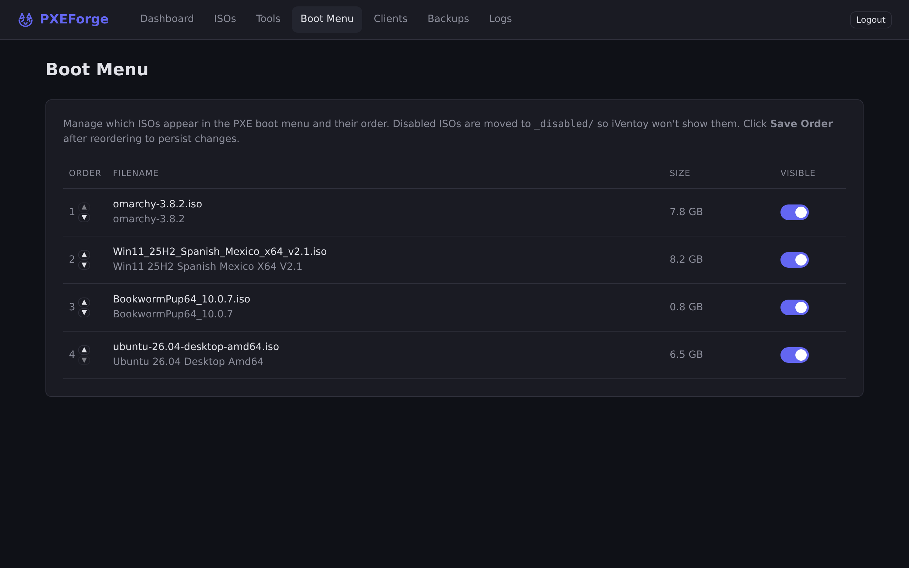
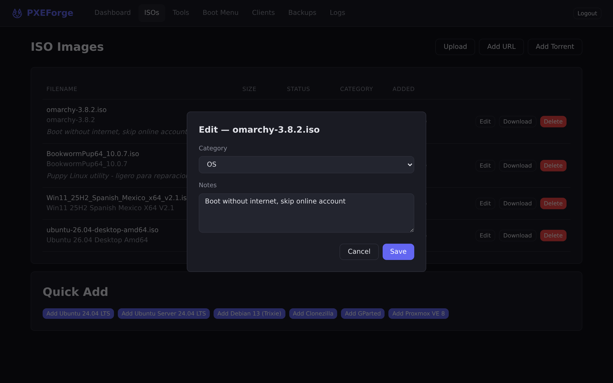

# PXEForge

> Appliance Dockerizado para boot PXE — iVentoy + FastAPI + React.


**PXEForge** es un appliance todo-en-uno para bootear máquinas por red usando PXE. Levanta iVentoy, un backend FastAPI con panel React, aria2 para descargas, Samba para compartir ISOs por red, y nginx como reverse proxy — todo orquestado con Docker Compose.

Categorizá ISOs entre **OS** y **Tools**, agregales notas, ocultálas del menú PXE, y gestioná todo desde una UI reactiva.

## Características

- **Catálogo de ISOs** — Subí, descargá (URL o Torrent), o agregá distros preconfiguradas (Ubuntu, Debian, Clonezilla, GParted, Proxmox) con un click
- **Tools & Notes** — Categorizá ISOs como OS o Tool, agregales notas descriptivas, y editalas desde un modal
- **Boot Menu Manager** — Reordená y ocultá ISOs del menú PXE fácilmente
- **Dashboard** — Estado de iVentoy, uso de disco, actividad reciente en tiempo real
- **Clientes PXE** — Detecta y lista máquinas que bootearon por red
- **Samba Share** — Accedé a los ISOs desde cualquier máquina de la red (Windows/Linux)
- **Backups** — Exportá la configuración del appliance en ZIP
- **Auditoría** — Log de todas las acciones con detalle

## Screenshots

| ISOs | Tools |
|------|-------|
|  |  |

| Boot Menu | Edit Notes |
|-----------|------------|
|  |  |

## Stack

| Componente | Tecnología | Rol |
|---|---|---|
| iVentoy | `szabis/iventoy` | ProxyDHCP + servidor PXE |
| Backend | FastAPI + SQLite | API REST + lógica de negocio |
| Frontend | React + Vite | SPA con router |
| Downloads | aria2-pro | HTTP + BitTorrent |
| File sharing | dperson/samba | SMB share de ISOs |
| Proxy | nginx:alpine | Unifica frontend y backend |

## Requisitos

- Docker + Docker Compose v2
- Linux con `network_mode: host` disponible (para iVentoy)
- Puertos libres: **8099** (web), **1399/4459** (Samba), **6800** (aria2), **6888** (DHT)
- Espacio en disco para ISOs

## Instalación

```bash
# Clonar
git clone https://github.com/BlackArock/pxeforge.git
cd pxeforge

# Crear .env a partir del template (ajustar credenciales)
cp .env.example .env

# Crear symlink a datos persistentes (opcional)
mkdir -p /mnt/Storage/pxeforge-data
ln -s /mnt/Storage/pxeforge-data data

# Levantar
docker compose up -d
```

## Configuración inicial

1. Accedé a `http://<server-ip>:8099` — login con `admin` / `admin123`
2. Agregá ISOs desde el catálogo o subí los tuyos
3. *(opcional)* Configurá DHCP de iVentoy:
   - Abrí `http://<server-ip>:26000`
   - Configurá DHCP con la IP del servidor
   - Cambiá `AUTO_START_PXE=true` en `docker-compose.yml`
   - `docker compose up -d`
4. Conectá una máquina a la red y booteá por PXE

## Desarrollo

```bash
# Backend
docker compose up -d --build backend
docker compose logs -f backend

# Frontend (hot reload local)
cd frontend
npm install
npm run dev  # → http://localhost:5173
```

## Variables de entorno (`.env`)

```
ADMIN_USER=admin
ADMIN_PASSWORD=admin123
SAMBA_USER=pxe
SAMBA_PASSWORD=pxe123
ARIA2_RPC_SECRET=pxeforge
JWT_SECRET=pxeforge-secret-change-in-production
IVENTOY_API_URL=http://host.docker.internal:26000
```

## Puertos

| Puerto | Servicio |
|---|---|
| 8099 | Web UI (nginx) |
| 26000 | iVentoy web (config) |
| 1399 | Samba (NetBIOS) |
| 4459 | Samba (SMB) |
| 6800 | aria2 RPC |

## Licencia

MIT
